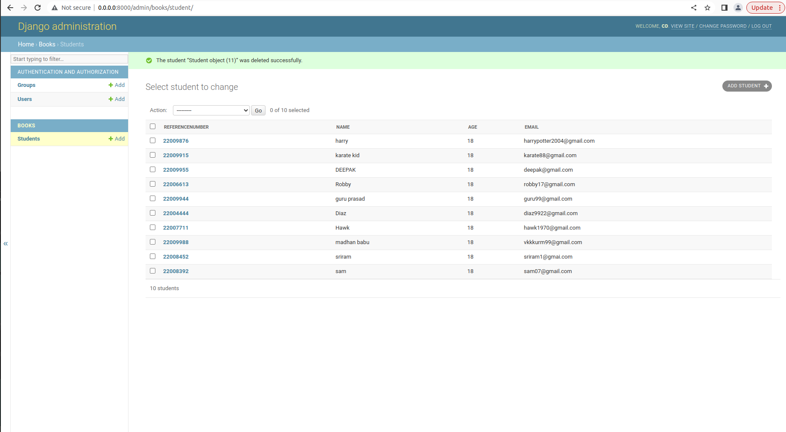

# Django ORM Web Application

## AIM
To develop a Django application to store and retrieve data from a database using Object Relational Mapping(ORM).

## Entity Relationship Diagram

Include your ER diagram here

## DESIGN STEPS

### STEP 1:

Starting a new project - 'dataproject'.

### STEP 2:

Starting an app - 'books'.

### STEP 3:

Creation of models and registering it.

### STEP 4:

Creation of superuser.

### STEP 5:

Running the server.

## PROGRAM
```
models.py

from django.db import models
from django.contrib import admin

class Student(models.Model):
    referencenumber = models.CharField(max_length=10, help_text="Your Reference Number")
    name = models.CharField(max_length=100)
    age = models.IntegerField()
    email = models.EmailField()
    phone = models.IntegerField()
    
class StudentAdmin(admin.ModelAdmin):
    list_display = ('referencenumber', 'name', 'age', 'email')


admin.py

from django.contrib import admin
from .models import Student, StudentAdmin

admin.site.register(Student,StudentAdmin)
```

## OUTPUT




## RESULT

Thus, a Django application to store and retireve data from a databas using Object Relational Mapping(ORM) is developed.